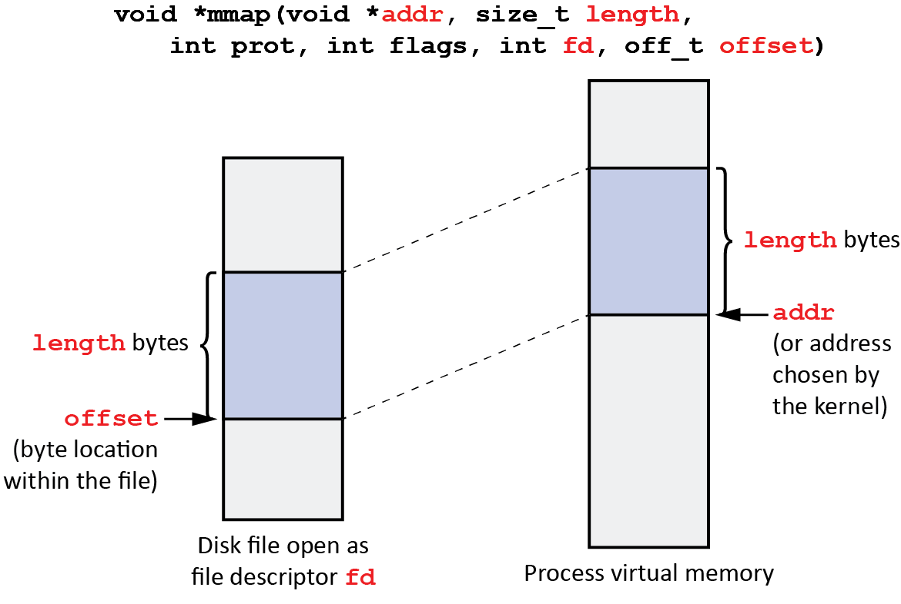

# Homework12: mmap

这节实验帮助我们熟悉Linux提供的mmap/munmap API。

#### Introduction to mmap/munmap

```c
void *mmap(void *start, size_t length, int prot, int flags, int fd, off_t offset);
int munmap(void *start, size_t length);
```

我们可以在CSAPP中看到mmap/munmap相关的内容。这两个函数是操作系统提供的、使我们可以直接分配**【虚拟地址空间】**并建立到内存/文件的映射。



此时分配VAS的空间后，系统并没有马上分配物理内存，而是采用了Copy-On-Write的设计方法。对于文件的映射同样如此，也即会在写时分配物理页并将文件中内容搬动到物理页上。

由此涉及到一个问题：利用mmap（flags & MAP_SHARED）进行进程间通讯时（IPC）会存在同步问题。根据mmap-manual，mmap并不保证在munmap前共享的内容会同步到文件中。Linux提供了一个手动写回的API ：*msync* 来解决这一问题。

而当 flags & MAP_ANONYMOUS 时，mmap将直接在VAS上分配一段空间，等到写时会分配一个实际物理页，从而达到了为进程提供内存分配的效果。【注：从C程序的移植性角度而言，实际用户程序分配内存还是会使用更上层的封装（如malloc）等API】


#### Homework

本节的题目要求我们在一定的限制条件下实现一个数值求根表。在 setup\_sqrt\_region() 中，程序使用mmap/munmap获得一个VAS中的地址（munmap后无效，直接访问会产生SIGSEGV信号）。之后我们要在这个地址上映射数值求根表，用以提供给 test\_sqrt\_region() 查询。而这个Homework还引入了一个限制条件，即可以使用的VAS size是有限的（通过 setrlimit 系统调用实现）：

```c
// Set a soft rlimit on virtual address-space bytes.
if (setrlimit(RLIMIT_AS, &lim) == -1) {
    fprintf(stderr, "Couldn't set rlimit on RLIMIT_AS; %s\n", strerror(errno));
    exit(EXIT_FAILURE);
}
```

因此我们不能在VAS上无限制地申请空间。Homework引导我们解决的方法是：每次查表发生访存错误（即查表位置的地址尚未映射）时先munmap上一次查询的表，再映射当前查询数值所在的页表上的求根表内容，也即：以一个页表大小的区域窗口来查询整个大求根表。根据这个要求，我们使用mmap/munmap函数实现SIGSEGV信号的处理函数：

```c
static void
handle_sigsegv(int sig, siginfo_t *si, void *ctx)
{
    // Your code here.
    static void* last_page;
  
    uintptr_t fault_addr = (uintptr_t)si->si_addr;

    if (last_page)
        munmap(last_page, page_size);
    last_page = (void*)align_down(fault_addr, page_size);
    mmap(
        last_page, page_size, PROT_READ | PROT_WRITE, 
        MAP_ANONYMOUS | MAP_PRIVATE, 0, 0
    );
    calculate_sqrts(
        (double*)last_page, (last_page - (void*)sqrts) / sizeof(double), 
        page_size / sizeof(double)
    );
}
```

