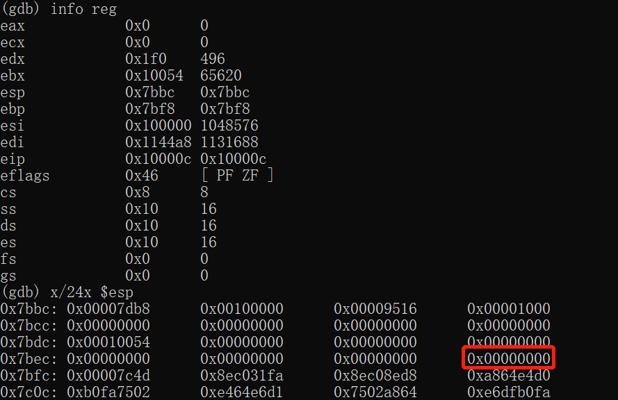

# Homework1: Boot xv6

​		这个Homework的内容与Lab1的部分基本相同，在这里我主要记录和梳理一些附加内容，作为对Lab1或对整个OS启动的知识补充。


### 关于实验环境的补充说明

​		启动xv6的方式与Lab1中启动JOS的方式相同，都是在*qemu*虚拟机上运行，并借助*gdb*进行调试。具体的流程我们可以根据`xv6-public/Makefile`中的内容来了解：

实际启动*qemu*的命令如下：

```shell
# Here use the xv6.img(which is the image file of the kernel)
qemu-system-i386 -serial mon:stdio -drive file=fs.img, \
index=1,media=disk,format=raw -drive file=xv6.img, \
index=0,media=disk,format=raw -smp 2 -m 512  \
-S -gdb tcp::25000
```

从命令可知，*qemu*运行后将开放`localhost:25000`端口作为GDB调试使用。在Homework Material中，示例在开启*qemu*后直接在另一终端启动*gdb*，然而实际并不能运行起来，因为*gdb*同样需要配置参数，而这些参数都被设置在`xv6-public/.gdbinit`中了。因此，我在Makefile中加了一句：

```shell
gdb:
	gdb -n -x .gdbinit
```

这样就可以使用`make gdb`正确运行调试了。

#### 题外话

**Note1**：*qemu*运行后的输出说明其在某个端口也打开了*VNC(Virtual Network Computing) Server*服务。

**Note2**：在Makefile中注意到*qemu*的输入是`xv6-public/kernel`的镜像文件`xv6.img`。这个镜像怎么来的呢？我们也可以从Makefile中得到答案：

```shell
# Make image file:
xv6.img: bootblock kernel
	# /dev/zero is a special file in xnix-like os that provides
	# as many null characters(0x00) as are read from it.
	dd if=/dev/zero of=xv6.img count=10000
	dd if=bootblock of=xv6.img conv=notrunc
	dd if=kernel of=xv6.img seek=1 conv=notrunc
	
# Make bootblock file
# CC = $(TOOLPREFIX)gcc
# LD = $(TOOLPREFIX)ld
bootblock: bootasm.S bootmain.c
	$(CC) $(CFLAGS) -fno-pic -O -nostdinc -I. -c bootmain.c
	$(CC) $(CFLAGS) -fno-pic -nostdinc -I. -c bootasm.S
	$(LD) $(LDFLAGS) -N -e start -Ttext 0x7C00 -o bootblock.o bootasm.o bootmain.o
	$(OBJDUMP) -S bootblock.o > bootblock.asm
	$(OBJCOPY) -S -O binary -j .text bootblock.o bootblock
	./sign.pl bootblock
```

可以看到，实际上这个镜像文件就是将*bootloader*和*kernel*一同纳入，使得*qemu*在加载时有引导的手段；在*bootloader*的Linking Address = 0x7c00，也就是*Boot Sector*被引导到的起始位置（与JOS相同）。

关于**镜像(image)**，它的定义接近于一个软件系统的状态快照。通过相应的软件进行读取，可以恢复出保存的软件运行状态，常用于操作系统、游戏等的制作。


### 练习解答：What is on the stack?

​		根据提示，我们要判断断点处的栈内存放着什么。据前面的内容我们知道断点位于xv6的*entry*处(0x1000c)，在该命令执行前对栈的操作共有三次：

```assembly
# 1st: in <bootasm.S>
# Set up the stack pointer and call into C.
movl    $start, %esp
call    bootmain

# 2nd: in <bootmain.c>
7d2a:	55                   	push   %ebp
7d2b:	89 e5                	mov    %esp,%ebp
7d2d:	57                   	push   %edi
7d2e:	56                   	push   %esi
7d2f:	53                   	push   %ebx
7d30:	83 ec 2c             	sub    $0x2c,%esp

# 3rd: at the end of <bootmain.c>
# Call the entry point from the ELF header.
# Does not return!
{
	...
entry = (void(*)(void))(elf->entry);
entry();
7db2:	ff 15 18 00 01 00    	call   *0x10018
}
7db8:	83 c4 2c             	add    $0x2c,%esp
...
```

我们使用GDB检查栈，输出结果如下：



结合上述的反汇编结果，我们知道0x7bbc位置存放的是调用`entry()`时压入的返回地址，而根据`%ebp`，上一帧的第一个字为红框圈出的位置；根据call的运行步骤（见`LabNotes/Lab1`）,0x7bfc存放的是调用`bootmain()`时压入的返回地址，且`%ebp`内容为0说明其之上的地址内容均不属于栈；`%esp`和`%ebp`中间存放着保留的寄存器等内容。