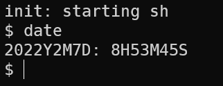

# Homework3: xv6 system calls

​		这个Homework的内容主要是借助xv6源码的内容先简单理解***system calls***的调用链以及构建一个system call并利用其构建内建命令的方法。Homework的内容分为两部分。


## Part One: System call tracing

​		这个任务是将系统初始化过程的系统调用及其返回值打印出来。任务的Hint提示得很清楚，只需修改 `syscall.c` 中的 `syscall()` 函数即可。观察可知这个函数是一个通用接口，通过 `kernel.asm` 可知其被 `trap()` 调用：

```assembly
void
trap(struct trapframe *tf)
{
  ...
80105094:	e8 47 f0 ff ff       	call   801040e0 <syscall>
    if(myproc()->killed)
80105099:	e8 12 e2 ff ff       	call   801032b0 <myproc>
8010509e:	8b 48 24             	mov    0x24(%eax),%ecx
801050a1:	85 c9                	test   %ecx,%ecx
801050a3:	0f 84 1d ff ff ff    	je     80104fc6 <trap+0x10e>
  ...
}
```

 并根据陷阱帧(*TrapFrame*)中记录的 `syscall id` 来调用具体的函数（通过函数指针数组实现）。因此，我们可以仿照它构建字符串数组，在调用前进行打印：

```c
static char* syscalls_name[] = {
[SYS_fork]    "fork",
...
[SYS_close]   "close",
};

void
syscall(void)
{
  int num;
  struct proc *curproc = myproc();
  num = curproc->tf->eax;
  if(num > 0 && num < NELEM(syscalls) && syscalls[num]) {
    curproc->tf->eax = syscalls[num]();
    /* ----------------Code---------------- */
    cprintf("%s -> %d\n", syscalls_name[num], curproc->tf->eax);
    /* ----------------Code---------------- */
  } else {
    cprintf("%d %s: unknown sys call %d\n",
            curproc->pid, curproc->name, num);
    curproc->tf->eax = -1;
  }
}
```

​	Challenge部分要求打印system calls的参数，可以注意到 `syscall.c` 文件中也包含 `argptr(), argint(), argstr()` 等函数用于打印参数，可利用这几个函数实现。


## Part Two: Date system call

​		这个任务是构建一个简单的 `date ` system call，用于显示当前时间。底层的实现需要与硬件交互，这部分被封装在 `lapic.c/cmostime()` 中，构建时直接调用填充 `rtcdate` 结构体即可；此外，还要构建一个User-level Program供使用者调用（类似于 `ls` 这样的Build-in Command）。

任务的提示是观察其他的system call（例如`uptime`）存在于哪些文件中并依此修改相应文件：

```c
grep -n uptime *.[chS]

// Output Result:
syscall.c:105:extern int sys_uptime(void);
syscall.c:121:[SYS_uptime]  sys_uptime,
syscall.h:15:#define SYS_uptime 14
sysproc.c:83:sys_uptime(void)
user.h:25:int uptime(void);
usys.S:31:SYSCALL(uptime)
```

实际上由于还要实现User-level Program，要修改的地方还要更多一些。

首先要做的是实现system call本身。根据在Part One中了解到的，我们在`syscall.c` 的函数指针数组中添加`SYS_date`，并在其对应的头文件 `syscall.h` 中指定这个调用的id；参考 `fork` 的实现位置，我们也在 `sysproc.c` 中实现一个`sys_date()`  ：

【 注意参数的调用方式：陷入内核后调用内容被保存至 TrapFrame 中，xv6封装了提取参数的函数：argint, argptr, argstr）】

```c
/* In sysproc.c */
// Add for 6.828 homework3
int
sys_date(void)
{
  struct rtcdate *now_date;
  if(argptr(0, (char **)(&now_date), sizeof(struct rtcdate)) < 0)
    return -1;
  cmostime(now_date);

  return 0;
}
```

完成 date-syscall 本身的功能实现后，我们需要为用户程序提供调用接口。用户态调用 `date()` 函数的符号定义应当被定义在 `usys.S` 文件中，以一个 SYSCALL 宏来实现：

```assembly
#define SYSCALL(name) \
  .globl name; \
  name: \
    movl $SYS_ ## name, %eax; \
    int $T_SYSCALL; \
    ret
```

可以看到函数的功能是记录 syscall-number 并发送中断向量，陷入内核态。这一用户态 syscall 调用接口被声明于 `user.h` 中，因此我们也在该文件中追加 `date()` 的声明：

```c
// in user.h
int date(struct rtcdate*);
```

这样用户态程序就可以使用 date 系统调用了。

我们依据 Homework 提示创建用户态程序 date.c，并修改 Makefile 将程序加入 UPROGS 中：

```c
#include "types.h"
#include "user.h"
#include "date.h"

int
main(int argc, char *argv[])
{
  struct rtcdate r;

  if (date(&r)) {
    printf(2, "date failed\n");
    exit();
  }

  // your code to print the time in any format you like...
  printf(
      1,
      "%dY%dM%dD: %dH%dM%dS\n",
      r.year,
      r.month,
      r.day,
      r.hour,
      r.minute,
      r.second
  );

  exit();
}
```

启动 xv6 并在 shell 输入 date，得到结果：





## Conclusion

​		这个实验通过构建一个简单的系统调用date、并构建用户态调用接口来了解xv6构建系统调用的逻辑层次。为了理清整个调用链，我们将这个构建流程的分为用户态和内核态两部分讨论。

​		内核部分拥有对date系统调用功能的完整实现，主要内容包含在 `syscall.h/syscall.c/sysproc.c` 这三个文件中。 `syscall.h` 中包含定义各系统调用号的宏， `syscall.c` 中包含系统调用函数（以 *sys_* 为前缀的函数），这是整个系统调用的框架。当硬件发生中断使操作系统陷入内核后，通过公用接口进入 `trap.c/trap()`，该函数通过中断向量进入 `syscall.c/syscall()` ，再根据保存在陷阱帧中的系统调用号分发调用。

​		用户部分根据前述实验内容，需要改动 `user.h/usys.S` 两个文件。`user.h` 中存放对系统调用的用户接口的声明。<u>最容易产生理解偏差的地方在于： user.h 中声明的用户接口函数对应的定义在哪儿</u>？需要明确的是，它们并不对应 `proc.c` 文件中的函数（大部分与用户接口同名且具有相同参数的函数），事实上这个文件中包含的是**内核**组件，它们对应的声明位于 `def.h` 中，是内核的构成部分。实际上， 用户接口是利用 `usys.S` 进行定义的。

这个宏对用户态函数进行统一的定义：将系统调用号放入EAX寄存器并发射系统调用的中断向量，实现与内核的通信，这也正是通过系统调用陷入内核态的方式。