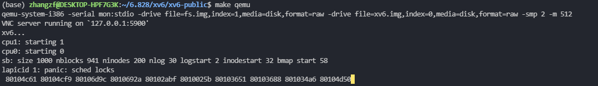

# Homework7: xv6 locking

### Don't do this

该 part 展示了如下的代码段，并要求我们用一句话解释会发生什么：

```c
struct spinlock lk;
initlock(&lk, "test lock");
acquire(&lk);
acquire(&lk);
```

-  **答：** xv6会判断 acquired 并产生一个panic，如无该判断会导致当前执行流陷入无法结束的死循环。

我们查看 **spinlock.c / acquire()** 的代码便可知：

```c
void
acquire(struct spinlock *lk)
{
  pushcli(); // disable interrupts to avoid deadlock.
  if(holding(lk))
    panic("acquire");

  // The xchg is atomic.
  while(xchg(&lk->locked, 1) != 0)
    ;
  ...
}
```

每次尝试获取自旋锁前，xv6调用 holding 函数确认当前 cpu 是否已经持有该锁，并对重复获取锁的行为进行 panic。如果没有这个分支判断，代码运行至 *xchg* 语句时将用1去将1换出，最终陷入死循环。并且，若此时其他 cpu 上进程尝试获得锁也会陷入同样的死循环。


### Interrupts in ide.c

xv6的自旋锁设计在获取时关闭中断（pushcli），在释放时重新打开中断（popcli）。

**【注】这里xv6设计上并不是直接使用 cli/sti 指令关闭/开启中断。每次 pushcli 会增加对应 cpu 上统计 cli 次数的引用计数，而 popcli 则会减少引用计数。只有当计数归0时，popcli 才真正使用 sti 指令重新启动中断。**

这一节的内容要求我们观察：若在获取自旋锁后开启当前cpu的中断，会发生什么问题。具体地，修改 ide.c 中一处使用自旋锁的代码，我们在其后使用 sti 命令开启中断。此处的 **ide.c / iderw()** 是向存储硬件（IDE）硬盘进行读写的函数【具体见xv6-book Chapter 3】：它负责将硬盘读写请求放入请求队列，并执行操作。可以看到，该函数在将读写请求放入队列、等待读写完成的过程全程持有自旋锁 idelock。我们知道，<u>一般硬盘读写的时间相对而言较长，因此这个临界区存在的时间也会比较长</u>，如果我们要检查若持锁期间开放中断会发生什么问题，选择这一持锁时间窗口较长的代码比较容易试出错误情况。

修改代码后 **make qemu** 编译 xv6 并运行，得到结果：（注：除这一结果外，也有可能触发 panic: acquire）



根据上述打印的地址，我们可以在 kernel.asm 中搜索并打印 call stack trace：

```shell
proc.c:sched()				# call panic()
proc.c:yield() 				# call release()
trap.c:trap()				# call myproc()
trapasm.S:alltraps			# call trap()
...
...
```

我们在 sched()-panic 处增加打印 ncli 计数的 cprintf 函数，多次得到结果主要为2。sched() 执行时需要保证当前 cpu 关闭中断计数有且仅有1**（原因尚未知，待进一步学习xv6调度内容）**，因此引发了异常。如果在获取自旋锁后保持关闭中断状态，则不会产生这一问题。


### Interrupts in file.c

在 **file.c/filealloc()** 中尝试持锁阶段打开中断，观察最后产生的结果。

结果是触发 panic 概率极小。file_table_lock 保护文件描述符表的读写，推测不引发 panic 的原因是 filealloc() 运行时间极短（而不像上一步等待硬盘读写命令的 idelock），较难遭遇中断。


### xv6 lock implementation

**问题：** 为什么 release() 要在释放锁之前置零 lk->pcs[0] 及 lk->cpu ？如果将这一步放到锁释放后会发生什么？

这两个变量分别记录当前获取锁的调用函数队列及持锁cpu，若在释放锁后修改，在修改前锁可能被其他线程抢占，无效的数据被误作有效数据读写，造出错误。

