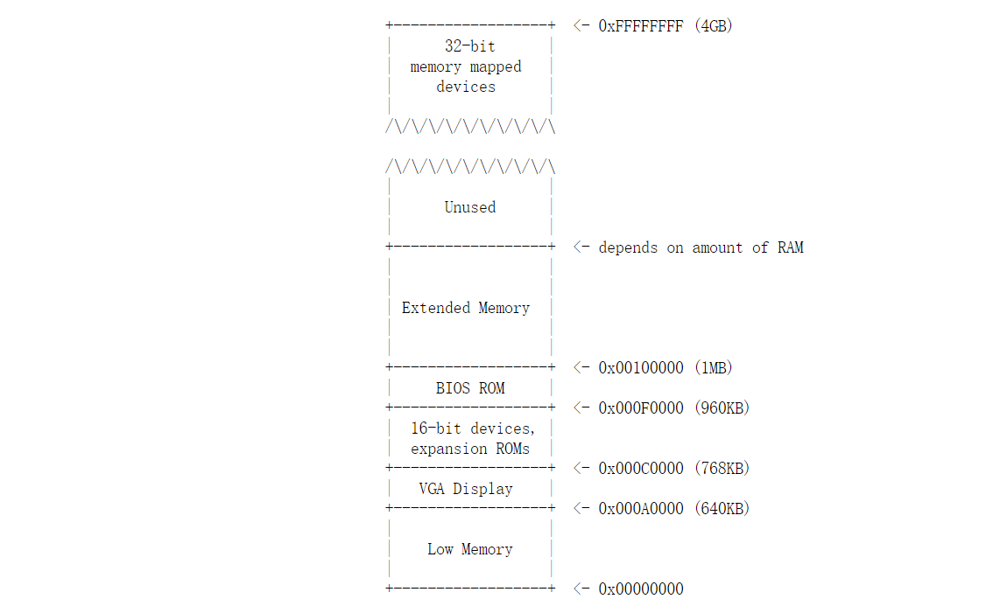
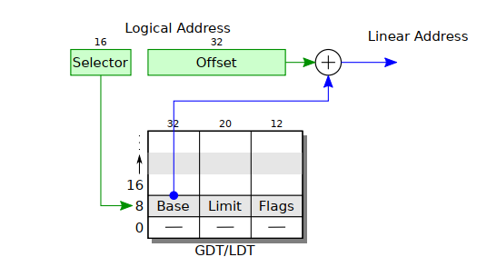

# Lab1: Booting a PC

- Lab: https://pdos.csail.mit.edu/6.828/2018/labs/lab1/


## Part 1: PC Bootstrap

### The PC's Physical Address Space



- 从0x000F0000到0x000FFFFF共64KB的地址空间为**BIOS(Basic Input/Output System)**保留，在早期PC中其一般写在ROM中，而在现代PC中被迁移到内存中来。其基本功能是：
  - 将硬件设置好，完成初始化
  - 将控制权转交给操作系统（这一步依靠读取OS的boot sector，其中含有**boot loader**代码段）

- PC启动后，默认工作在**Real Mode**下：20-bits地址空间。8088的寄存器只有16位，故采用的是**段寻址**的模式：`(segment-register)<<4 + base-address`


### Exercises

- **Exercise 1**

  熟悉x86-Assembly以及QEMU，无填充内容

- **Exercise 2**

  通过QEMU的单步调试查看BIOS的内容，无填充内容


## Part 2: The Boot Loader

本次实验中使用的Boot Loader源码由两部分组成：`boot/boot.S`，`boot/main.c`

程序流程：

- **boot.S**

  - 关闭中断（中断系统原本由BIOS设置开启，此处暂时关闭）
  - 使能A20地址线
  - 从**Real Mode**切换到**Protect Mode**（32-bits地址空间）：
    - 设置segment descriptor table **GDT**，构建Physical Address到Virtual Address的映射（Base=0）
    - 将`%cr0`寄存器的`CR0_PE`置位，启动Protect Mode
  - 调用`main.c`

  

  

- **main.c （Loading the Kernel）**

  JOS-kernel是以**ELF(Executable and Linkable File)**形式存在的，这段源码的目的是将这段内核加载到内存中。整个流程分为两步：

  - 调用`readseg`函数从磁盘上加载内容至内存
  - 调用`stosb`将segment-registers设置为0

  解析关键函数`readseg`：

  - **readseg(uint32_t pa, uint32_t count, uint32_t offset)**

    函数作用是“将一个segment加载到内存中”，具体地，将kernel从`offset`开始的`count`字节读入`pa`（physical address）所在的位置。读入时以一个扇区为单位读入（通过调用`readsect`实现），因此可能会多读入一部分内容。

    第一次对`readseg`的调用读4096（512*8）个字节，其实是ELF-Header的内容；

    根据读入的ELF-Header确定程序段的位置，将kernel加载到内存。


### Exercises

- **Exercise 3**

  -  从`ljmp $PROT_MODE_CSEG, $protcseg` 指令开始进入32-bit mode；
  - 查看`obj/boot.asm`（boot loader的反汇编文件）可知，boot loader最后一条指令为：`call   *0x10018`；查看`obj/kernel.asm`可知，kernel的第一条指令为：`movw $0x1234,0x472`；
  - 根据boot loader的最后一条指令，可以确定kernel第一条指令的物理地址是`0x10018`；

  - 根据ELF-Header提供的信息确定读取的扇区数量。

- **Exercise 4**

  ​	熟悉C语言，无填充/问答内容

- **Exercise 5**

  ​	本题是修改Makefile中Linker的链接地址（BIOS默认将boot sector载入的地址为`0x7c00`），观察boot loader行为的异常。

  ​	由于BIOS是写死的，所以实际上boot sector仍被载入到原定的`0x7c00`位置；而Linker参数的修改导致了boot loader在链接时符号重定位位置发生了改变，不一致发生：当使用到需重定位的符号时，程序将出现问题。具体到本例，第一条出现问题的命令是`lgdt`指令（但蜜汁顺利加载成功），然后在`ljmp`启动32-bit mode时崩溃。

- **Exercise 6**

  在BIOS引导进入boot loader前，`0x0010000`处内容为空；进入kernel前，`0x0010000`处已经有了内容，前后的区别在于kernel被加载进来了。


## Part 3: The Kernel


### Using virtual memory to work around position dependence

​	查看kernel的反汇编文件`kern/kernel.asm`可以发现，其链接完成后的入口地址为`0xf010000`（位于地址空间高处），而实际上我们有时会在物理内存较小的PC上运行这个OS，这时我们需要通过映射将高位地址映射到低位的物理地址。

​	根据`boot.S`的内容我们知道，此时我们仍使用物理地址（或者说与物理地址完全相同的Linear Address），而Lab的说明告诉我们：`entrypgdir.c`构建从高位到低位的映射后，运行`movl %eax, %cr0`，映射:

`(0xf0000000,0xf0400000)` --> `(0x00000000,0x00400000)`，

`(0x00000000,0x00400000)`-->`(0x00000000,0x00400000)`

被设置完成。


### Formatted Printing to the Console

​	本节内容是实现控制台格式化输出的代码的讨论。

​	涉及的代码主要是`kern/print.c`，`kern/console.c` 以及`lib/printfmt.c`（Guide专门提到了一个问题：为什么`printfmt.c`放在了`lib`下而不是`kern`？）

​	具体的分析见Exercise 8的讨论。


### The Stack

​	本节内容是进一步深入JOS堆栈和程序调用栈的细节。

​	x86堆栈指针寄存器 `%esp` 指向堆栈中正在被使用的部分的最低地址。**在32-bit mode时，每次对堆栈操作时都是以32bit为单位的，因此`%esp`是4字节对齐的（由调用者/被调用者维护）**。而 `%ebp` 寄存器则是记录每一个程序的栈帧的相关信息的寄存器，每个程序运行时会分配一个栈帧，用于存放临时变量、传递参数等。

​	x86程序一般会遵循这样一个规则：当发生调用时，将当前的`%ebp`(base-pointer)入栈，然后将当前`esp`的内容放入`%ebp`中，再将`%esp`内容递减。这种调用栈的模式提供了"Traceback"的可能性。（具体调用流程参考Exercise 10的内容）


### Exercises

- **Exercise 7**

  ​	观察`movl %eax, %cr0`运行前后高位地址空间中（如：`0xf0100000`）内容的变化。映射前，高位地址处内容为空；映射后，`0xf0100000`的内容与`0x00100000`内容相同（因为实际上指向了同一物理地址）。

- **Exercise 8**

  ​	需要增加的代码段是`lib/printfmt.c`中的`vprintfmt`函数中的内容。这个函数本身是一个C格式化字符串的打印解析器，需要添加的代码是`%o`的处理；处理数字打印的函数也是完善的，因此只需在switch代码块中增添跳转处理即可。

  ​	`printf.c`提供的是用户接口（主要指`cprintf`），而`cprintf` 调用`lib/printfmt.c`提供的用于将输出格式化的`vprintfmt`接口。

  ​	`console.c`则将与屏幕显示的硬件交互封装起来，提供了供`printfmt.c`调用的`cputchar`接口，无需直接处理底层细节。

  - **问题1**： Explain the interface between `printf.c` and `console.c`. Specifically, what function does `console.c` export? How is this function used by `printf.c`? 

    答：`console.c`为`print.c`（实际上是还有`printfmt.c`这一中间层）封装了底层硬件交互的接口，具体指用于在显示设备上打印单一字符的`cputchar(char)`。

  - **问题2**：Explain the code in `cga_putc`  from `console.c`（具体见Lab Guide）.

    答： 当屏幕输出满了以后，将屏幕上的内容都向上移一行，即将第一行移出屏幕，同时将最后一行用空格填充，最后将光标移动到屏幕最后一行的开始处。 

  - **问题3**： Trace the execution of the following code step-by-step （见Lab Guide）
  
    答：
  
    - 断点调试或直接查看`kernel.asm`文件可以发现，调用cprintf时参数入栈顺序时从右往左，即va先入栈，最后字符串常量地址入栈。`ap`指向从左往右第一个va参数，`fmt`指向字符串常量。
  
      **（PS：C处理可变参数是自右向左依次入栈，且并不需要知道参数个数）**
  
    - （待解决）
  
  - **问题4**：Run the following code（见Lab Guide）
  
    答：这道题展示了little-end machine和big-end machine的区别。x86是little-end类型，打印结果会是：
  
    ​		`He110,World`
  
    ​		因为`57616`的16进制表示为`e110`，`0x00646c72`在little-end machine中存放字节依次为`0x72`，`0x6c`和`0x64`，正好对应`r,l,d`三个字母。而如果是big-end machine的话，57616不必更改，但i必须修改为`0x726c6400`。
  
  - **问题5**： In the following code, what is going to be printed after `'y='`? Why does this happen? 
  
    ​				`cprintf("x=%d y=%d",3)`
  
    答：无法产生正常结果。根据我们前面对`cprintf`调用的分析，如果编译器不检查这个错误，则会出现		`y`对应的取值从栈中再取一个（错误）参数，内容不可预知。
  
  - **问题6**：（待解决）

- **Exercise 9**

  ​	kernel在 `0xf0100034` 处指令（调用init前）将栈指针初始化为 `0xf0117000` 。（见`kernel.asm`）

  ​	然后我们再遁入`entry.S`，可以看到`KSTKSIZE`参数，查看其宏定义可以发现`KSTKSIZE = (8*PGSIZE)`	,而根据`mmu.h`的定义，`PGSIZE=4096`，故内核栈的大小为`4KB*8=32KB`，且向下伸展，故内核栈段的Virtual Address为` 0xf010f000 -- 0xf0117000`，对应Physical Address段为` 0x0010f000 -- 0x00117000`。

  ​	由上可见，kernel通过`entry.S`中可见的操作为自己保留了一段32KB的空间作为堆栈。

- **Exercise 10**

  ​	断点检查`backtrace(5)`的调用情况。根据"The Stack"节以及断点分析，我们发现调用时依照以下步骤：		
  
  - `call` 指令将返回地址入栈（`%esp` 值减少4字节）
  - 将 `%ebp` 入栈 （`%esp` 值减少4字节，累计8字节）
  - 将 `%esp` 值赋给 `%ebp` 
  - 将 `%ebx` 入栈（约定保护的寄存器值）（`%esp` 值减少4字节，累计12字节）
  - `%esp` 减去20(0x14)个字节**（保证对齐）**给临时变量使用
  
  ​	上述指令执行完成后，`%esp` 值减小了32字节，`%ebp` 存放当前程序调用帧的第一个32-bit字地址。由此可知，每次调用`backtrace()`时会有32字节（也即8个32-bit words）入栈，内容依次为：程序返回地址，上一个程序帧的位置，保护寄存器的值，临时变量使用的空间。
  
  

- **Exercise 11**

  实现 `mon_backtrace` 接口。可以利用 `x86.h` 中的`read_ebp()` 接口获得 `%ebp` 中的值。

  ```c
  int
  mon_backtrace(int argc, char **argv, struct Trapframe *tf)
  {
  	// Your code here.
  	cprintf("Stack backtrace:\n");
  	uint32_t* _ebp = (uint32_t*)read_ebp();
  	while(_ebp != NULL)
  	{
  		cprintf("ebp %08x ",_ebp);
  		uint32_t _eip = *(_ebp + 1);
  		cprintf("eip %08x args",_eip);
  
  		uint32_t _tmp;
  		for(size_t i = 0; i < 5;++i)
  		{
  			_tmp = *(_ebp + i + 2);
  			cprintf(" %08x",_tmp);
  		}
  		cprintf("\n");
  		_ebp = (uint32_t*)(*_ebp);
  
  	}
  	return 0;
  }
  ```
  
- **Exercise 12**

  （待补充）