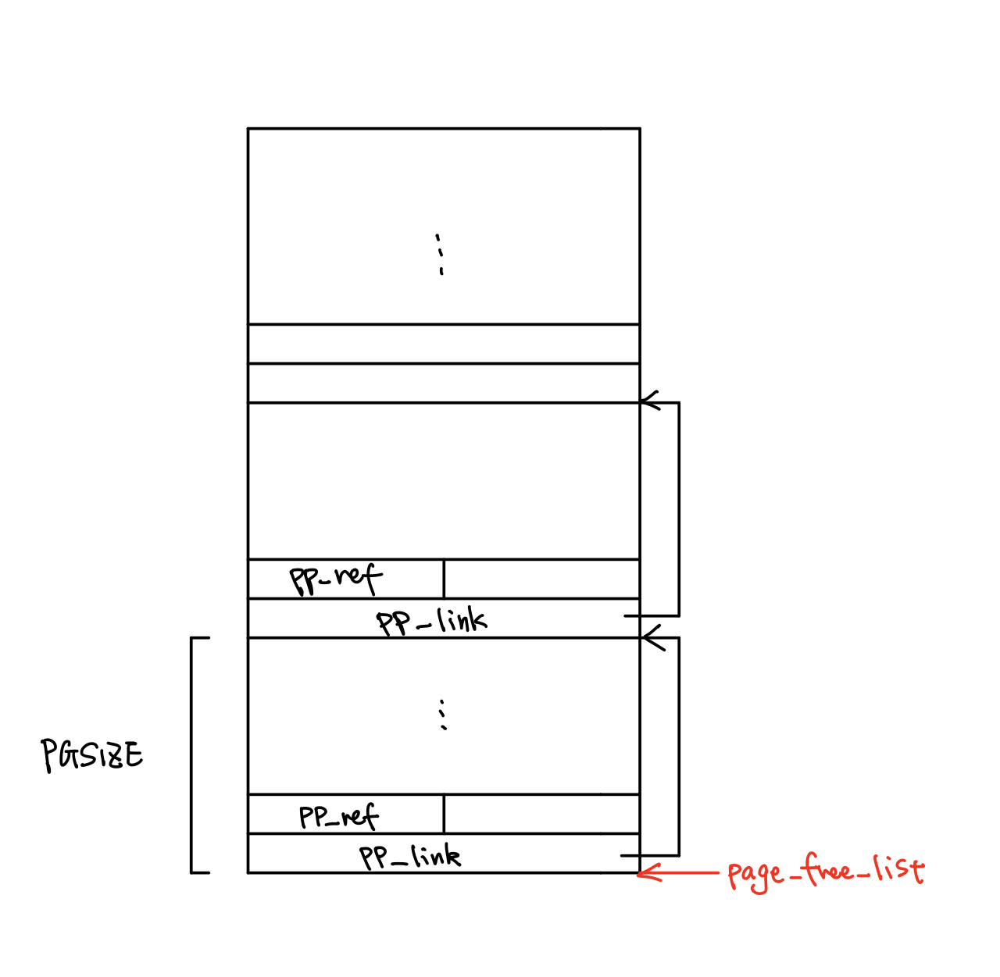
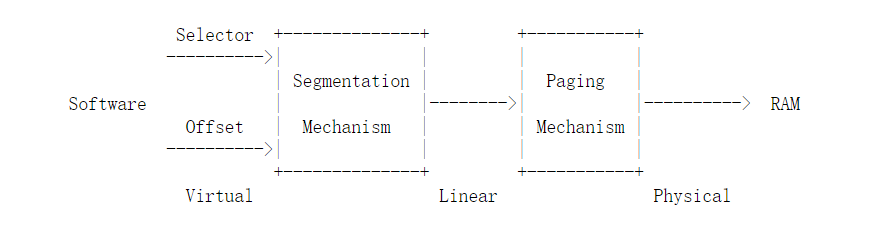

# Lab 2: Memory Management

- Lab:  https://pdos.csail.mit.edu/6.828/2018/labs/lab2/ 

  ​	这个实验的主要工作其实就是开始构建JOS的*Virtual Memory System*，完成*Kernel Address Space*的映射。在Lab1中，我们使用 `entrypgdir.c` 将高位的4MB映射到了低位的4MB物理地址空间中，这其实就是简单的小虚拟内存系统了。Lab2要做的事情是在这4MB地址空间中完成一个二级页表的*Virtual Memory System*，并通过`lcr/rcr` 指令将其设置为JOS的内存系统。

  ​	在实验开始前，高位内存映射是 `[KERNBASE, KERNBASE+4MB) --> [0, 4MB) `，我们将把这个区域的空间的一部分为新的内存映射提供页表。当前的高位映射是即将完成的新映射的子集。
  
  ​	另外补充一点：使用多级页表的情况下，**页表级数是由CPU决定的**，系统位数变化时，页表结构需要重写。32位平台一般使用2级页表，而x86-84则一般使用4级页表。
  
  

## Part 1: Physical Page Management

​	本节的内容是完成Physic Page Allocator部分的代码。

​	JOS的Physical Memory管理是以页为单位的（颗粒度为页，*Page granularity*），核心的数据结构是`struct PageInfo` ：一个List-Node like的单元，用于记录某个page是否被使用，并在`kern/pmap.h` 中实现了一些宏，用于根据一个该类型对象找到对应的page，或根据page的物理地址找到对应的node。

​	空闲页列表 `page_free_list` 是这样组织的：在 `boot_alloc()` 创建时，连续的空闲空间以每间隔一个PGSIZE的地址被记录，相当于每一个空闲页的头部放着下一个空闲页的首地址和`pp_ref`。



### Exercises

- **Exercise 1**

  实现 `kern/pmap.c` 关于Physical Page Management的相关代码。

  

  - **boot_alloc**

    这个函数作为JOS在初始化Virtual Memory System时使用的allocator存在，初始化完成后使用 `page_alloc()` 作为真正的allocator使用：这个函数只用来分配  `pgdir` （一级页表）以及 `pages array` （页表信息数组），加起来不超过4MB（**也即Lab1中完成了高位到低位映射的4MB空间**）。
  
    实际上这也说明，像`KADDR PADDR` 这样的宏也**仅在这段映射内是正确的**。
  
    ```c
    static void *
    boot_alloc(uint32_t n)
    {
    	static char *nextfree;	// virtual address of next byte of free memory
    	char *result;
    
    	// Initialize nextfree if this is the first time.
    	// 'end' is a magic symbol automatically generated by the linker,
    	// which points to the end of the kernel's bss segment:
    	// the first virtual address that the linker did *not* assign
    	// to any kernel code or global variables.
    	if (!nextfree) {
    		extern char end[];
    		nextfree = ROUNDUP((char *) end, PGSIZE);
    	}
    
    	// Allocate a chunk large enough to hold 'n' bytes, then update
    	// nextfree.  Make sure nextfree is kept aligned
    	// to a multiple of PGSIZE.
    	//
    	// LAB 2: Your code here.
    	result = nextfree;
    	nextfree = ROUNDUP(nextfree + n, PGSIZE);
    
    	if(PADDR(nextfree) >= 0x40000 || nextfree < result)
    		// Here used macro 'PADDR' to get the physic address
    		panic("boot alloc: out of memory.\n");
    	return result;
    }
    ```

    

  - **mem_init** (实现到 `check_page_free_list(1)` 前)
  
    这个函数是整个 `kern/pmap.c` 的功能核心，完整分析在后面进行。补充的代码段如下：
    
    ```c
    pages = (struct PageInfo*) boot_alloc(npages*sizeof(struct PageInfo));
    memset(pages,0,npages*sizeof(struct PageInfo));
    ```
  
    这段代码在4MB的已映射区域内分配了一个PageInfo数组，它将被用来追踪物理页的情况。此时先将所有记录初始化为0。

  
  
  - **page_init**
  
  ​	完成VM分页功能启动的初始化：将所有页的Info放入 `page_free_list` 中备用（相当于初始化该List）。实际工作要稍微复杂些，主要因为有一些特殊情况：
  
  - 第一个page不被使用；
    - 在 `[IOPHYSMEM,EXTPHYSMEM)` 地址段的内存是为IO准备的（*IO Hole*），这段的pages也不被使用。
  
    综合上述情况，pageInfo的初始化应当分段进行。代码如下：
  
    ```c
    void
    page_init(void)
    {
    	size_t i;
    	// for situation(1)
    	pages[0].pp_ref = 1;
    	// for situation(2)
    	for (i = 1; i < npages_basemem; i++)
    	{
    		pages[i].pp_ref = 0;
    		// At the first time, the page_free_list will be 'NULL'
    		// When pp.link = NULL, it means that no more free_page after
    		// this node.
    		pages[i].pp_link = page_free_list;
    		page_free_list = &pages[i];
    	}
    	// for situation(3)
    	/*
    
    	PC's physical address space:
    
    		...
    	
    	------------ <- 0x100000
    	| BIOS ROM |
    	------------
    	| expand R | 	I/O Hole
    	------------
    	|    VGA   |
    	------------ <- 0x0A0000
    	|  Low Mem |
    	------------ <- 0x000000
  	
    	where the '96' comes from:
		(EXTPHYSMEM - IOPHYSMEM) / PGSIZE
    	  = (0x100000   - 0x0A0000 ) / 0x1000
	  =  0x6 = (DEC)96
    
  	*/
    	const size_t pages_in_use_end = npages_basemem + 96 + (PADDR(boot_alloc(0))) / PGSIZE;
    	for(; i < pages_in_use_end; ++i)
    		pages[i].pp_ref = 1;
    	// for situation(4)
    	for(;i < npages;++i)
    	{
    		pages[i].pp_ref = 0;
    		pages[i].pp_link = page_free_list;
    	page_free_list = &pages[i];
    	}	
    }
    ```
    
    
    
  - **page_alloc （pages分配功能核心）**
  
    ​	如前文所述，这个函数是VM系统初始化完成后真正的allocator。其工作是查找 `page_free_list`（即记录空闲页的List like structure，Node即为 `PageInfo` ），取出一个page分配给调用者。
  
    ```c
    struct PageInfo *
    page_alloc(int alloc_flags)
    {
    	// Fill this function in
        if(!page_free_list)
            return NULL;
    	struct PageInfo *result = page_free_list;
    	page_free_list = page_free_list->pp_link;
  	result->pp_link = NULL;
    	if(alloc_flags & ALLOC_ZERO)
          /* See notes below */
    		memset(page2kva(result),0,PGSIZE);
  	return result;
    }
    ```
    
    这里需要特别指出的是 `page2kva` 函数在这里的应用。从函数原型我们也可以猜到这是根据以 `PageInfo` 指针作为输入得到与该Node对应的页的物理地址。我们进入 `pamp.h` 并展开该函数的调用：
    
    ```c
    /*
      ORIGINAL CALL:
      	static inline void*
          page2kva(struct PageInfo *pp)
          {
              return KADDR(page2pa(pp));
          }
    */
    static inline void*
        page2kva(struct PageInfo *pp)
    {
        // pages: the global static array of PageInfos
        // PGSHIFT: 12 = log2(PGSIZE)
        // KERNBASE: 0xF0000000 (kernel's base address)
        return ((pp - pages) << PGSHIFT) + KERNsBASE);
    }
    ```
    
    
  
    ​	展开后我们就可以很清楚地看到 `PageInfo Node` 是怎么跟物理页联系的了：`pages` 中Node的index（或者说offset）与其对应的物理页的offset是相同的，对应映射一个PGSIZE的地址段作为页。
  
  
  
  - **page_free**
  
    ​	与 `page_alloc` 是功能对称的，用于将调用者返回的页释放，将被释放页信息重新写入 `page_free_list` 中备下次使用。
  
    ```c
    void
    page_free(struct PageInfo *pp)
    {
    	// Fill this function in
    	// Hint: You may want to panic if pp->pp_ref is nonzero or
    	// pp->pp_link is not NULL.
    	if(pp->pp_link == NULL)
    		panic("page_free error:pp_link = NULL!\n");
    	if(pp->pp_ref != 0)
    		panic("page_free error:pp_ref != 0!\n");
    	struct PageInfo *insert_point = page_free_list;
    	pp->pp_link = page_free_list;
    	page_free_list = pp;
    }
    ```
  
    

## Part 2: Virtual Memory

### Virtual, Linear and Physical Address



​		x86体系之中的地址概念可以分为三个：首先是程序中使用的**虚拟地址**（*Virtual Address*），它由Selector（段地址）以及Offset（段内偏移）构成；虚拟地址经过翻译变成所谓**线性地址**（*Linear Address*），根据到目前为止我的理解，它应该正是Paging机制中的虚拟页号；然后根据Paging机制查找对应的页表项（PTE），最后得到**物理地址**（*Physical Address*）。

​		在这个Lab中我们暂且不讨论分段机制的作用（回忆Lab1的内容，我们在初始化GDT的时候实际上关闭了segment translation），留待Lab3处理。

​		JOS使用的Virtual Memory System为**二级页表**，维护*Page Directory Table* 和 *Page Table* 两类结构。

​		应当指出的是，在Lab1中分析Boot Loader的时候我们已经了解到，在进入protect mode之后，程序中出现的所有地址都是虚拟地址。JOS定义了 `unitptr_t` 和 `physaddr_t` 类型，分别表示虚拟地址与物理地址。为了防止对其直接解引用，两者都被设置为 `uint32_t` 类型；需要解引用时，首先需进行类型转换。


### Reference Counting

​		这一小节对 `PageInfo` 中的 `pp_ref` 作了一点注释：系统被设计为一个物理页可以被多个虚拟页映射到，同时系统维护 `pp_ref` 作为引用计数。当这个计数变为0时，调用 `page_free` 回收该页。

​		这里应当注意的是这个计数的维护是由 `page_alloc` 和 `page_free` 的**调用者**负责的，在两个函数内部并不直接增减其数值。


### Page Table Management

​		这部分内容集中在Exercise 4中，主要是实现页管理与查找的函数。具体见Exercise 4的内容。


### Exercises

- **Exercise 2**

  熟悉80386处理器中关于三种地址的概念定义，详见 *Virtual, Linear and Physical Address* 部分。

  

- **Exercise 3**

  使用qemu调试观察VA与PA的映射是否成立，这个与Lab1中的Exercise 7雷同，此处也不赘述。

  

- **Exercise 4**

  ​	完成page操作的一系列接口的实现，其中主要是利用Exercise 1中实现的接口进行进一步的抽象封装，构成真正可用的API。

  - **pgdir_walk**

    通过一级页表和给定的*Virtual Address*返回*PTE*的函数。

    **（注：Page-Directory中的Page Address都为Physical Address）**
  
    ```c
    pte_t *
    pgdir_walk(pde_t *pgdir, const void *va, int create)
    {
    	// Fill this function in
    	pde_t* pde = pgdir + PDX(va);
    	if(!(*pde & PTE_P))
    	{
    		if(!create)
    			return NULL;
    		else
    		{
    			struct PageInfo* new_p = page_alloc(1);
    			if(!new_p)
    				return NULL;
    			(new_p->pp_ref)++;
    			// *pde = page2pa(new_p);
    			// Noted that state bits are essensial
    			*pde = (page2pa(new_p) | PTE_P | PTE_W | PTE_U);
    		}
    	}
    	
        // The page-addresses in Page-Directory are 'physical address'
  	return (pte_t*)(KADDR(PTE_ADDR(*pde))) + PTX(va);
    }
    ```
  
  
  
- **boot_map_region**
  
    ​	被 `mem_init` 调用，用于实现*Virtual Address*到*Physical Address*的映射。
  
    ```c
    static void
    boot_map_region(pde_t *pgdir, uintptr_t va, size_t size, physaddr_t pa, int perm)
    {
    	// Fill this function in
    	// pde_t* pde;
    	pte_t* pte;
    	// Don't do this: (because division is very slow)
    	// size_t page_nums = size / PGSIZE;
    	size_t offset = 0;
    	for(; offset < size; offset += PGSIZE, va += PGSIZE, pa += PGSIZE)
    	{
    		// Wrong:(pa in pde is 'the pa of a page', not 'the pa to be mapped')
    		// pde = pgdir + PDX(va + offset);
    		// *pde = ((pa+ offset) | perm | PTE_P);
    		pte = pgdir_walk(pgdir,(void*)va, 1);
    		*pte = (pa | perm | PTE_P);
    	}
    
    }
  ```
  
  
  
- **page_lookup**
  
    ​	通过一级页表和*Virtual Address*找到对应页的 `PageInfo` 节点。
  
    ```c
    struct PageInfo *
    page_lookup(pde_t *pgdir, void *va, pte_t **pte_store)
    {
    	// Fill this function in
    	pte_t* pte = pgdir_walk(pgdir, va, 0);
    	if(!pte || !(*pte & PTE_P))
    		return NULL;
    	if(pte_store != NULL)
    		*pte_store = pte;
    	return pa2page(PTE_ADDR(*pte));
    }
  ```
  
  
  
- **page_remove / page_insert**
  
    用于建立/删除一个页与一个*Virtual Address*间的映射。
  
    ```c
    void
    page_remove(pde_t *pgdir, void *va)
    {
    	// Fill this function in
    	pte_t* pte_tobe_rm;
    	struct PageInfo* pp_tobe_rm = page_lookup(pgdir, va, &pte_tobe_rm);
    	if(!pp_tobe_rm)
    		return;
    
    	*pte_tobe_rm = 0;
    	page_decref(pp_tobe_rm);
    	tlb_invalidate(pgdir,va);
    	
    }
    
    int
    page_insert(pde_t *pgdir, struct PageInfo *pp, void *va, int perm)
    {
    	// Fill this function in
    	pte_t* now_pte = pgdir_walk(pgdir, va, 1);
    	if(!now_pte)
    		return -E_NO_MEM;
    	// increment here: consider the Corner-Hint
    	(pp->pp_ref)++;
    	if( *now_pte & PTE_P)
    		page_remove(pgdir, va);
    	*now_pte = (page2pa(pp) | perm | PTE_P);
    	return 0;
    }
   ```
  
    


## Part 3: Kernel Address Space

​		这部分内容是明确kernel态和用户态在地址空间使用上的隔离，并完成完整地址空间映射。

​		在Lab1中我们借助 `kern/entrypgdir.h` 映射了4MB的空间使用，但这是不足够的。

​		我们知道OS的一个重要特点是区分代码的访问权限，从而保证系统的稳定性和运行正确。具体而言，JOS在进入32-bit mode之后，将虚拟内存空间（其实准确的说，应该是线性地址空间）以 `ULIM` 为界分为上下两部分。


### Permission and Fault Isolation

​		JOS的地址空间结构见`kern/memorylaout.h` 。`ULIM` 以上的地址空间为为内核保留的*Kernel Address Space*，约有256MB，只允许内核态程序读写，并被映射到低位物理空间（见Lab1）；`[UTOP,ULIM)` 段的地址为保留固定内核数据结构的位置，内核态和用户态的程序都被设置为只读权限；`UTOP` 以下的地址空间为用户态使用。


### Initializing the Kernel Address Space

​		这部分内容要求完成对*Kernel Address Space*的初始化。

-  **Questions**
  1. 见Exercise 5的内容；
  2. 根据 `memorylayout.h` 的描述，Entry取自虚拟地址的高10位，根据这种映射对应即可找到填入内容；
  3. 这是通过设置perm bits来实现的，用户无法访问没有 `PTE_U` 权限的页；
  4. 最大能支持4GB的空间，因为地址由32-bits组成；
  5. 如果实际使用4GB物理地址空间，我们需要提供：一级页表4KB，页表2MB，以及pages数组4MB。
  6.  在 `entry.S` 中有一个指令 `jmp *%eax`，这个指令要完成跳转，就会重新设置EIP的值，把它设置为 `%eax` 中的值，而这个值是大于 `KERNBASE` 的，所以就完成了EIP从小值到大于KERNBASE的值的转换。 


### Address Space Layout Alternatives


### Exercises

- **Exercise 5**

  ​	根据本节讲解部分的内容，需要我们完成*Kernel Address Space*的初始化，具体工作为将*Virtual Address*映射到相应的*Physical Address*上。构建映射具体来说就是填充*Page Directory*和*Page Table*结构中相应项。

  ​	根据提示，三个小节的代码都由 `boot_map_region` 函数完成映射工作。

  ​	第一部分是将 `pages` 映射为*user-read-only*，且根据 `kern/memorylayout.h` 中的地址空间框架，这部分（RO PAGES）占据一个 `PTSIZE` 大小的段。

  ```c
  // Note: PTE_P permission has been added by boot_map_region itself.
  boot_map_region(kern_pgdir, UPAGES, PTSIZE, PADDR(pages), PTE_U);
  ```

  ​	第二部分是映射内核栈。根据提示，内核栈实际大小为一个 `PTSIZE` ，即 `[KSTACKTOP-PTSIZE, KSTACKTOP)` 地址段，这个地址段被进一步细分为两部分：

  ​	`[KSTACKTOP-KSTKSIZE, KSTACKTOP)` ：backed by physical memory

  ​	`[KSTACKTOP-PTSIZE, KSTACKTOP-KSTKSIZE)` ：not backed

  ​	也即是说，只有第一部分的虚拟地址空间被映射到了物理地址空间中，作为实际的内核栈使用。第二部分的内存段是未构建映射的，也就是说一旦发生写内核栈溢出，就会直接报错而不会出现覆写原有数据的情况，因此第二部分内存段也被称为***Guide Page***。

  ```c
  boot_map_region(kern_pgdir, KSTACKTOP - KSTKSIZE, KSTKSIZE, PADDR(bootstack), PTE_W);
  ```

  ​	第三部分将高位虚拟内存地址段 `[KERNBASE, 2^32)` 映射到低位物理段 `[0, 2^32 - KERNBASE)` 。

  ​	这一步与Lab1中借助 `kern/entrypgdir.c` 构建映射是相同的概念，只是这一次映射了完整的256MB（注意：实际运行的机器中可能并没有这么多的物理内存）。

  ```c
  /* Note: 0x10000000 comes from (4G - KERNBASE) = 0x100000000 - 0xf0000000 */
  boot_map_region(kern_pgdir, KERNBASE, 0x10000000, 0, PTE_W);
  ```

  