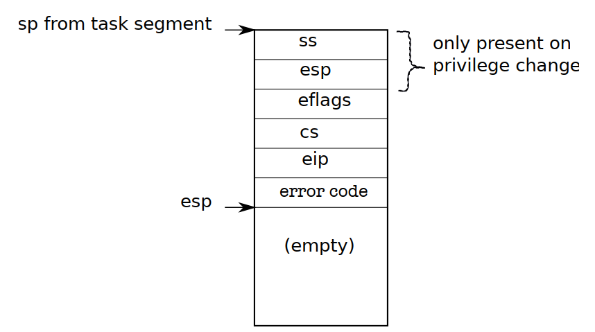

# Lab3: User Environments

- Lab:  https://pdos.csail.mit.edu/6.828/2018/labs/lab3/ 

  这个实验的主要工作是构建*User-mode environment*（这里的environment与process同义）。


## Part A: User Environments and Exception Handling

JOS对*user process*的抽象设计放在 `inc/env.h & kern/env.c` 中，主要数据结构是 `struct Env`，使用三个全局变量：`envs, curenv, env_free_list` 对所有用户进程及当前进程进行管理。

### A.1 Environment State

对于每一个用户进程，JOS用 `struct Env` 来描述：

```c
struct Env {
	struct Trapframe env_tf;	// Saved registers
	struct Env *env_link;		// Next free Env
	envid_t env_id;			// Unique environment identifier
	envid_t env_parent_id;		// env_id of this env's parent
	enum EnvType env_type;		// Indicates special system environments
	unsigned env_status;		// Status of the environment
	uint32_t env_runs;		// Number of times environment has run

	// Address space
	pde_t *env_pgdir;		// Kernel virtual address of page dir
};
```

其中当空闲env被放入`env_free_list` 中时依靠 `env_link` 构建链表。

JOS的Environment组成与\*nix系统相似，由*Thread*和*Address Space*两部分概念组成：前者由 `env_tf` 中的寄存器描述，后者由 `env_pgdir` 指向的页表目录描述。

另外需要注意JOS与xv6的区别：JOS采用的是*Single Kernel Stack*的设计，一次只能有一个进程陷入内核；而xv6的每个进程都拥有独立的内核栈（xv6的进程由 `struct proc` 描述）。


### A.2 Allocating the Environments Array

JOS管理Environments的方式与管理Pages相同，维护一个数组 `struct Env *envs`。

- **Exercise 1**

  在 `pmap.c/mem_init()` 中增加对 `envs` 的映射。跟Pages一样，我们首先为这个数组分配物理空间：

  ```c
  // LAB 3: Your code here.
  extern struct Env* envs;	// In env.c
  envs = (struct Env*) boot_alloc(NENV*sizeof(struct Env));
  memset(envs, 0, NENV*sizeof(struct Env));
  ```

  其中*NENV*定义在 `inc/env.h` 中。完成空间分配后我们将其映射到VAS：根据 `memlayout.h` ，JOS在Pages数组下方保留一段空间(size=PTSIZE)用于放置Envs数组，我们采用Lab2的方法映射过去：

  ```c
  // LAB 3: Your code here.
  boot_map_region(kern_pgdir, UENVS, 
                  ROUNDUP(NENV * sizeof(struct Env), PGSIZE), 
                  PADDR(envs), PTE_U);
  ```


### A.3 Creating and Running Environments

映射完成后，我们需要对Environments进行初始化使其可以运行。在当前实验阶段JOS还没有文件系统，因此实验**从镜像中读取进程状态**。这些镜像被嵌在JOS内核中，以*ELF*形式保存。

实验提示我们去观察 `kern/Makeflag` 中的情况，我们会发现：

```makefile
# Binary program images to embed within the kernel.
# Binary files for LAB3
KERN_BINFILES :=	user/hello \
                    user/buggyhello \
                    user/buggyhello2 \
                    user/evilhello \
                    user/testbss \
                    user/divzero \
                    user/breakpoint \
                    user/softint \
                    user/badsegment \
                    user/faultread \
                    user/faultreadkernel \
                    user/faultwrite \
                    user/faultwritekernel
```

这些二进制文件像.o文件一样被直接“链接”到内核中。再观察 `obj/kern/kernel.sym` （kernel的符号表），可以发现链接器会赋予这些二进制文件一些相对复杂的符号供内核使用：

```
0000e844 A _binary_obj_user_hello_size
0000e846 A _binary_obj_user_softint_size
0000e848 A _binary_obj_user_evilhello_size
...
```


- **Exercise 2**

  这一节需要完成Environments的初始化，这个步骤由 `init.c` 交给 `kern/env.c/env_init()` 完成。根据提示我们依次完成下列函数：

  - **env_init()**

    将Exercise 1中映射完成的 `envs` 放入空闲进程链表 `env_free_list` 中，方法与Lab2相似，注意实验Hint中指明放入链表的顺序应与数组下标序相同：

    ```c
    void
    env_init(void)
    {
    	// Set up envs array
    	// LAB 3: Your code here.
    
    	int i = 0;
    	for(; i < NENV - 1; ++i)
    	{
    		envs[i].env_link = &(envs[i+1]);
    		envs[i].env_status = ENV_FREE;
    		envs[i].env_id = 0;
    	}
    	envs[i].env_link = NULL;
    	envs[i].env_status = ENV_FREE;
    	envs[i].env_id = 0;
    
    	env_free_list = envs;
    	// Per-CPU part of the initialization
        // Configures the segmentation hardware with
        // separate segments for privilege level 0(kernel)
        // and privilege level 3(user)
    	env_init_percpu();
    }
    ```

    

  - **env_setup_vm()**

    当建立新进程时，调用此函数来构建其*Address Space*。我们为其分配一个Page作为该进程的页表目录，并对其内容进行初始化：其中内核部分的映射与现有的内核页表目录 `kern_pgdir` 完全相同，我们可以直接拷贝；另外需单独映射*UVPT*段（每个进程不同），这是JOS保留用于映射当前进程页表的区域：

    ```c
    static int
    env_setup_vm(struct Env *e)
    {
    	int i;
    	struct PageInfo *p = NULL;
    
    	// Allocate a page for the page directory
    	if (!(p = page_alloc(ALLOC_ZERO)))
    		return -E_NO_MEM;
    
    	// Now, set e->env_pgdir and initialize the page directory.
    	//
    	// Hint:
    	//    - The VA space of all envs is identical above UTOP
    	//	(except at UVPT, which we've set below).
    	//	See inc/memlayout.h for permissions and layout.
    	//	Can you use kern_pgdir as a template?  Hint: Yes.
    	//	(Make sure you got the permissions right in Lab 2.)
    	//    - The initial VA below UTOP is empty.
    	//    - You do not need to make any more calls to page_alloc.
    	//    - Note: In general, pp_ref is not maintained for
    	//	physical pages mapped only above UTOP, but env_pgdir
    	//	is an exception -- you need to increment env_pgdir's
    	//	pp_ref for env_free to work correctly.
    	//    - The functions in kern/pmap.h are handy.
    
    	// LAB 3: Your code here.
    	p->pp_ref++;
    	e->env_pgdir = page2kva(p);
    	memcpy(e->env_pgdir, kern_pgdir, PGSIZE);
    	// UVPT maps the env's own page table read-only.
    	// Permissions: kernel R, user R
    	e->env_pgdir[PDX(UVPT)] = PADDR(e->env_pgdir) | PTE_P | PTE_U;
    
    	return 0;
    }
    ```

    

  - **region_alloc()**

    当进程需要新的空间时，调用此函数申请物理空间并进行映射。

    ```c
    static void
    region_alloc(struct Env *e, void *va, size_t len)
    {
    	// LAB 3: Your code here.
    	// (But only if you need it for load_icode.)
    	//
    	// Hint: It is easier to use region_alloc if the caller can pass
    	//   'va' and 'len' values that are not page-aligned.
    	//   You should round va down, and round (va + len) up.
    	//   (Watch out for corner-cases!)
    	void* start = ROUNDDOWN(va, PGSIZE);
    	void* last = (void *)ROUNDUP(va+len, PGSIZE);
    	struct PageInfo* pp;
    
    	if(e == NULL)
    		panic("The struct e could not be null.");
    
    	while(start < last)
    	{
    		if(!(pp = page_alloc(1)))
    			panic("region_alloc: page alloc failed.");
    		if(page_insert(e->env_pgdir, pp, start, PTE_U | PTE_W))
    			panic("region_alloc: page mapped failed.");
    		start += PGSIZE;
    	}
    }
    ```

    

  - **load_icode()**

    这个函数用于从*ELF*形式的镜像中读取内容，加载到对应的进程中。当创建进程时（根据 `env.c` ，创建进程由 `env_alloc()` 完成，其会调用前面完成的`env_setup_vm()`，因此进程内核映射已经设置完成），我们将相应的内容加载映射到user部分。

    读取*ELF*文件的方法参考 `boot/main.c/bootmain()` ，同时我们认为待读取的*ELF*文件已被放入内存中（形参中binary为一地址）。重新回顾ELF文件的格式：

    

    我们主要从*Program Header*处获得信息，利用前面完成的 `region_alloc()` 构建映射。另外需要注意的是，我们将内容复制到进程地址空间时，需要使用 `memset()/memcpy()` ，它们是基于当前使用的页表项工作的，因此**我们需要先切换到所处理进程的页表**，完成设置后再切换回来。另外，由于内核部分的映射用户进程与内核进程一致，故不影响已在内存中的*ELF*的读取。

    ```c
    static void
    load_icode(struct Env *e, uint8_t *binary)
    {
    	// Hints:
    	// ...
    
    	// LAB 3: Your code here.
    	struct Proghdr* ph, *eph;
    	struct Elf* elf;
    	elf = (struct Elf*) binary;
    	if(elf->e_magic != ELF_MAGIC)
    		panic("load_icode error: ELF file not valid.");
    
    	ph = (struct Proghdr *) ((uint8_t *) elf + elf->e_phoff);
    	eph = ph + elf->e_phnum;
    
    	lcr3(PADDR(e->env_pgdir));
    
    	uint32_t va;
    	for(; ph < eph; ph++)
    	{
    		if(ph->p_type != ELF_PROG_LOAD)
    			continue;
    		va = (uint32_t)binary + ph->p_offset;
    		region_alloc(e, (void*)ph->p_va, ph->p_memsz);
    		memset((void*)ph->p_va, 0, ph->p_memsz);
    		memcpy((void*)ph->p_va, (void*)va, ph->p_filesz);
    
    	}
    	
    	// Now map one page for the program's initial stack
    	// at virtual address USTACKTOP - PGSIZE.
    
    	// LAB 3: Your code here.
    	region_alloc(e, (void*)(USTACKTOP - PGSIZE), PGSIZE);
    	lcr3(PADDR(kern_pgdir));
    
    	e->env_tf.tf_eip = elf->e_entry;
    }
    ```

    同时注意到，我们也为进程[USTACKTOP - PGSIZE, USTACKTOP)段分配了空间（根据 `memlayout.h` ，这一段地址为*User Exception Stack*）；最后，设置PC为*ELF*中的程序入口地址。

  ​	

  - **env_create()**

    用于创建并利用进程进行初始化的函数。

    （暂时有疑问：如何追踪已创建的进程？仅通过 `envs` 来访问？）

    ```c
    void
    env_create(uint8_t *binary, enum EnvType type)
    {
    	// LAB 3: Your code here.
    	struct Env* e;
    	if(env_alloc(&e, 0) < 0)
    		panic("Env create error: env_alloc failed.");
    	load_icode(e, binary);
    	e->env_type = type;
    }
    ```

    

  - **env_run()**

    用于切换当前运行进程。根据提示，`env_pop_tf()` 函数用于将trapframe中的保存的寄存器写回，同时返回至*user mode*（说明该函数应该为陷入*kernel mode*时运行）。

    ```c
    void
    env_run(struct Env *e)
    {
    	// LAB 3: Your code here.
        // Noted that without the first condition
        // (the curenv is not NULL) you can't pass
        // 'make grade' test.
    	if(curenv && curenv->env_status == ENV_RUNNING)
    		curenv->env_status = ENV_RUNNABLE;
    	curenv = e;
    	curenv->env_status = ENV_RUNNING;
    	curenv->env_runs++;
    	lcr3(PADDR(curenv->env_pgdir));
    
    	env_pop_tf(&(curenv->env_tf));
    	// panic("env_run not yet implemented");
    }
    ```

    

### A.4 Handling Interrupts and Exceptions

Part A后半部分的内容涉及中断和异常的处理。按照作业提示，在 `hello.asm` 中找到引发程序停止的位置 `int $0x30` ，这个错误是由于 `int` 指令发送中断向量后没有对应的处理程序(*handler*)所致。

（注：在该Lab中，interrupt，trap，exception和fault的细微差别不被考虑，视作等价概念）

- **Exercise 3**

  阅读材料，略。


### A.5 Basics of Protected Control Transfer

异常(*Exception*)和中断(*Interrupt*)都属于保护控制转移(*Protect Control Transfer*)，根据Intel的定义，前者是指由当前运行的进程引起的同步(*synchronous*)信号，也称为**内部中断**（一般被设计为不可屏蔽的）；而后者指外部设备引发的异步(*Asynchronous*)信号，例如硬盘等I/O设备发送的信号，也称**外部中断**。

x86体系使用两种机制来提供这种保护：

- **中断向量表(Interrupt Descriptor Table, IDT)**

  设置对应不同**中断向量**（一个整数）的handler入口。x86最多接受256个不同的中断/异常，CPU以IDT为索引找到处理程序的入口。CPU利用该表执行两件事：

  - 将处理程序加载到EIP寄存器（也即PC寄存器）
  - 将特权级加载到CS(Code Segment)寄存器

- **任务状态段(Task State Segment, TSS)**

  在加载新的执行位置和特权级前，**需保存当前进程的信息，同时将栈切换到内核栈**。x86提供一个TSS结构，这个结构内容很多，JOS只使用它的 `ESP0` 和 `SS0` 段来切换到内核栈。


### A.6 Types of Exceptions and Interrupts & Example

x86的0~31中断向量用于映射已定义的硬件中断，大于31的中断向量只能被软件中断或异步中断使用。**Part A的最后一个任务是使JOS正常处理0~31号中断，在Part B会尝试处理软件中断。**


x86中发送中断的指令是 `int n` 指令，它完成以下任务：

- 根据n索引IDT找到程序入口
- 检查 `%cs` 的权限位(CPL)
- 将`%esp` 和 `%ss` 存入CPU内部空闲寄存器
- 从TSS中加载内核栈的 `%ss` 和 `%esp`
- 将旧的 `%ss`，`%esp`，以及 `%eflags`，`%cs`，`%eip`依次入栈
- 如果类型为Interrupt，则将 `%eflags` 的IF位清0（IF: Interrupt Enable Flag，置0时屏蔽外部中断）
- 将控制交给IDT表中对应的处理函数入口（处理函数负责调用 `iret` 退出中断处理）




### A.7 Nested Exceptions and Interrupts

当已经处于内核态时，也可以继续嵌套处理中断和异常，此时会在内核栈中继续装填处理帧，唯一不同的是不会再将 `%ss` 和 `%esp` 入栈。


### A.8 Setting Up the IDT

- **Exercise 4**

  这一部分实验要完成对IDT的基本初始化，修改 `trapentry.S` 和 `trap.c`。

  `trapentry.S` 中提供了两个宏 `TRAPHANDLER/TRAPHANDLER_NOEC` 用于生成处理函数入口（与xv6中的`vectors.pl` 功能相似），其中产不产生Error Code由Exercise 3中提供的材料可以了解到，当然也可以偷懒直接参考xv6的源码。设置代码如下：

  ```assembly
  /*
   * Lab 3: Your code here for generating entry points for the different traps.
   */
  TRAPHANDLER_NOEC(DIVIDE, T_DIVIDE)
  TRAPHANDLER_NOEC(DEBUG, T_DEBUG)
  TRAPHANDLER_NOEC(NMI, T_NMI)
  TRAPHANDLER_NOEC(BRKPT, T_BRKPT)
  TRAPHANDLER_NOEC(OFLOW, T_OFLOW)
  TRAPHANDLER_NOEC(BOUND, T_BOUND)
  TRAPHANDLER_NOEC(ILLOP, T_ILLOP)
  TRAPHANDLER_NOEC(DEVICE, T_DEVICE)
  TRAPHANDLER(DBLFLT, T_DBLFLT)
  TRAPHANDLER(TSS, T_TSS)
  TRAPHANDLER(SEGNP, T_SEGNP)
  TRAPHANDLER(STACK, T_STACK)
  TRAPHANDLER(GPFLT, T_GPFLT)
  TRAPHANDLER(PGFLT, T_PGFLT)
  TRAPHANDLER_NOEC(FPERR, T_FPERR)
  TRAPHANDLER(ALIGN, T_ALIGN)
  TRAPHANDLER_NOEC(MCHK, T_MCHK)
  TRAPHANDLER_NOEC(SIMDERR, T_SIMDERR)
  TRAPHANDLER_NOEC(SYSCALL, T_SYSCALL)
  TRAPHANDLER_NOEC(DEFAULT, T_DEFAULT)
  ```

  观察两个宏的定义，都能发现设置完后都会跳转到 `__alltraps` 入口进行通用处理，根据作业提示并参考xv6的源码，完成代码如下：

  ```assembly
  /*
   * Lab 3: Your code here for _alltraps
   */
   .global _alltraps
  _alltraps:
  	pushl %ds
  	pushl %es
  	pushal
  	movw $GD_KD, %ax
  	movw %ax, %ds
  	movw %ax, %es
  	pushl %esp
  	call trap
  ```

  这段代码最后会跳转到 `trap.c/trap()` 进行真正的中断处理。

  最后，我们需要填写用于trap初始化的 `trap.c/trap_init()` 函数，同样可以参考xv6：

  ```c
  void
  trap_init(void)
  {
  	extern struct Segdesc gdt[];
  
  	// LAB 3: Your code here.
  	// Declare the functions from trapentry.S
  	void DIVIDE();
  	void DEBUG();
  	void NMI();
  	void BRKPT();
  	void OFLOW();
  	void BOUND();
  	void ILLOP();
  	void DEVICE();
  	void DBLFLT();
  	void TSS();
  	void SEGNP();
  	void STACK();
  	void GPFLT();
  	void PGFLT();
  	void FPERR();
  	void ALIGN();
  	void MCHK();
  	void SIMDERR();
  	void SYSCALL();
  	void DEFAULT();
  
  	SETGATE(idt[T_DIVIDE], 0, GD_KT, DIVIDE, 0);
  	SETGATE(idt[T_DEBUG], 0, GD_KT, DEBUG, 0);
  	SETGATE(idt[T_NMI], 0, GD_KT, NMI, 0);
  	SETGATE(idt[T_BRKPT], 0, GD_KT, BRKPT, 0);
  	SETGATE(idt[T_OFLOW], 0, GD_KT, OFLOW, 0);
  	SETGATE(idt[T_BOUND], 0, GD_KT, BOUND, 0);
  	SETGATE(idt[T_ILLOP], 0, GD_KT, ILLOP, 0);
  	SETGATE(idt[T_DEVICE], 0, GD_KT, DEVICE, 0);
  	SETGATE(idt[T_DBLFLT], 0, GD_KT, DBLFLT, 0);
  	SETGATE(idt[T_TSS], 0, GD_KT, TSS, 0);
  	SETGATE(idt[T_SEGNP], 0, GD_KT, SEGNP, 0);
  	SETGATE(idt[T_STACK], 0, GD_KT, STACK, 0);
  	SETGATE(idt[T_GPFLT], 0, GD_KT, GPFLT, 0);
  	SETGATE(idt[T_PGFLT], 0, GD_KT, PGFLT, 0);
  	SETGATE(idt[T_FPERR], 0, GD_KT, FPERR, 0);
  	SETGATE(idt[T_ALIGN], 0, GD_KT, ALIGN, 0);
  	SETGATE(idt[T_MCHK], 0, GD_KT, MCHK, 0);
  	SETGATE(idt[T_SIMDERR], 0, GD_KT, SIMDERR, 0);
  	SETGATE(idt[T_SYSCALL], 1, GD_KT, SYSCALL, 3);
  	SETGATE(idt[T_DEFAULT], 0, GD_KT, DEFAULT, 0);
  
  
  	// Per-CPU setup 
  	trap_init_percpu();
  }
  ```

  


## Part B: Page Faults, Breakpoints Exceptions, System Calls

